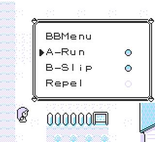
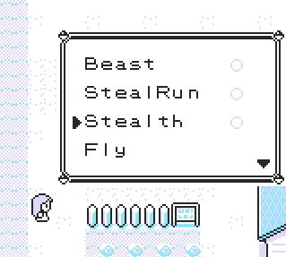
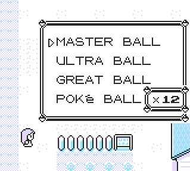
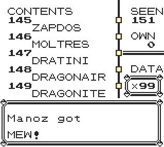
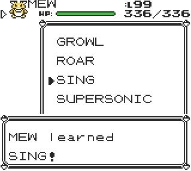
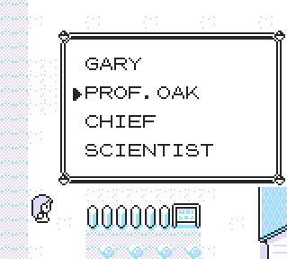
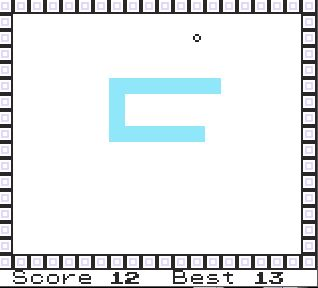

# BBMenu
*The first mod menu for Generation 1 Pokemon Games*

---

## 📷 Screenshots

  
    
  
  

  
    
  

---

Compatible with Pokémon Red, Blue and Yellow English versions, as well as VC releases. 

BBMenu can be installed inside your savegame using Arbitrary Code Execution, thus it can run in **original copies**, unlike any other ROMhacks!

## ✅ What BBMenu allowes you to do:
- Use constant effects like **Running, Walking through Walls, Beast Mode, Trainer Avoidance** etc.
- Get any **Item, Pokémon** or **Moveset**. 
- Instantly encounter any **Pokémon** or **Trainer** (yes, OAK is included!).
- Instantly get max **Money, Coins, Badges** etc.
- Launch custom **mini-games** like **Snake**!
- All from an in-game menu, with a simple press of **Select button**!

---

## ✅ Requirements
- A **Gameboy** or **3DS** console or a compatible **emulator** (BGB recommended).
- An **original** copy of English **Pokémon Red, Blue or Yellow**, a **VC release** or an **original ROM file**.
- TimoVM's [modernized ACE](https://glitchcity.wiki/wiki/Guides:TimoVM%27s_gen_1_ACE_setups) setup.
- Latest version of [TimOS](https://glitchcity.wiki/wiki/Guides:Nickname_Writer_Codes) environment.
- A cup of coffee and a lot of patience!

---

## 🔗 Installation

After setting up TimOS environment (required), you need to insert all hex code parts, the same way you did with the ACE setup.
- Copy and paste the code from part1 in the [Nickname Converter](https://timovm.github.io/NicknameConverter/).
- Write all nickname codes in Nickname Writer and press start in the verification screen of the last one to execute it.
- If you input everything correctly the game does not crash and you can make a save (required for parts 1 and 2). In different case, reset and repeat.
- Repeat the procedure until every hex part is installed. Parts 3 and on do not require saving the game, since they install payloads directly into the save file.

---

## ⚠ Warnings!
- **DO NOT OPEN** BBMenu with SELECT button until the installation is complete, otherwise a crash is guaranteed, especially if parts 2 and 3 are missing!
- During nickname input, code in part 1 is crucial. If you dont input EXACTLY what is shown, there is a high chance your savegame will be messed up!
- Always double check that you copy and paste every single byte. This is the stupidest, yet most common, way to say goodbye to your save file!
- **Slip script** allows you to walk through walls. Although it includes some basic prevention, walking outside map's borders risks crashing the game with your savegame being deleted! **Use with Caution!**
  
## ⚠ Notes
Part codes from 2+ are more tolerant to input errors, since their payloads activate only through BBMenu and a crash can indicate which part you need to reinstall.
That being said, here is what every part includes:
- Part1: Kernel stuff
- Part2: Constant effect payloads
- Part3: BBMenu layout
- Part4: Run, Slip, Repel, Beast, StealRun, Stealth, Fly, Heal, PC, Items scripts
- Part5: Moves, Pokemon, Wilds scripts
- Part6: Trainers, Instatext, Filldex, Badges, Cash, Coins, Duplicator scripts
- Part7: Pong
- Part8: Snake

---

### 🔧 How it works:
Pokémon Generation 1 games contain a large amount of unused space within their save files. BBMenu takes advantage of this by storing its data there through Arbitrary Code Execution (ACE). When the game loads, BBMenu uses specific hijacking techniques to inject its kernel into memory and load any required libraries.

The kernel continuously runs active payloads in the background and can trigger the script menu on demand. Each menu payload is first copied into WRAM before it runs. This design ensures full compatibility with Virtual Console (VC) releases, which cannot execute code directly from the save file — unlike the original Game Boy cartridges.

---

## 💬 Contact

Feel free to fork, reuse, or propose new modules! For personalised requests and collaborations, please contact me at manoz.dev25@gmail.com.

---

## 🧠 Credits

- Pret for [Red](https://github.com/pret/pokered) and [Yellow](https://github.com/pret/pokeyellow) disassemblies, which allowed me to reverse engineer crucial game's logic and make the menu functional.
- [RGBDS](https://rgbds.gbdev.io/), which allowed me to develop [QuickRGBDS wrapper](https://github.com/M4n0zz/QuickRGBDS) and make this super complicated project easier to build and maintain.
- My mentor TimoVM from [Glitch City Research Institute](https://glitchcity.wiki/wiki/Main_Page) and his [ACE guides](https://glitchcity.wiki/wiki/Guides:TimoVM%27s_gen_1_ACE_setups).
- Everyone in [GCRI Discord channel](https://discord.gg/EA7jxJ6). Thank you guys for your motivation and support!

